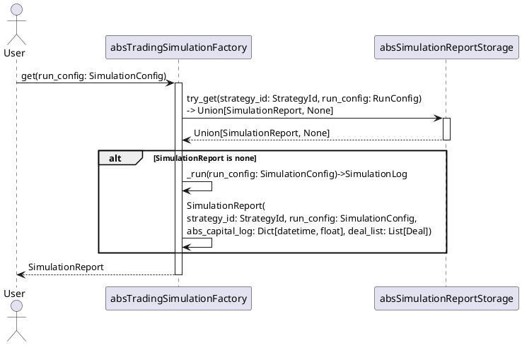
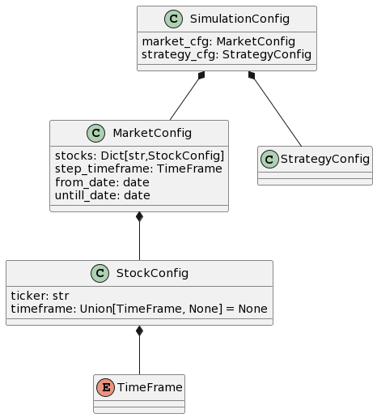

# Abstract Trading Simulation Factory
[class absTradingSimulationFactory](../src/simulation/abs_trading_simulation_factory.py)




## Configuration

```plantuml
class SimulationConfig {
market_cfg: MarketConfig
strategy_cfg: StrategyConfig
}

class MarketConfig {
stocks: Dict[str,StockConfig]
step_timeframe: TimeFrame
from_date: date
untill_date: date
}

class StockConfig {
ticker: str
timeframe: Union[TimeFrame, None] = None
}

enum TimeFrame

class StrategyConfig

SimulationConfig *-- MarketConfig
MarketConfig *-- StockConfig
StockConfig *-- TimeFrame
SimulationConfig *-- StrategyConfig
```

### Simulation

- Testing - testing strategies
- Optimization - strategy optimizer
- ReportFactory - Build reports
  - TestingReportFactory - Build reports of testing process
  - OptimizationReportFactory - Build reports of optimization process
- MetricSource - wrapper of strategy result, which return [base metrics](./Metrics.md#base-metrics)