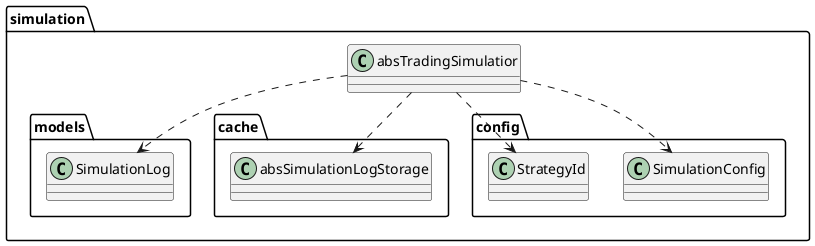
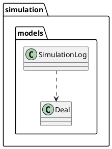
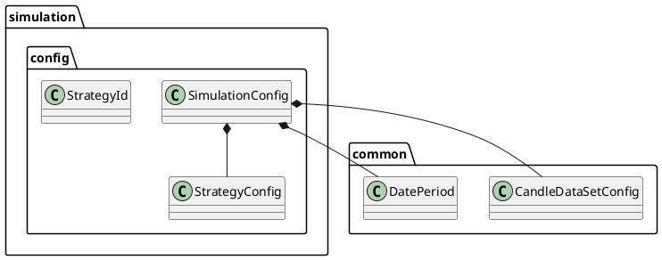
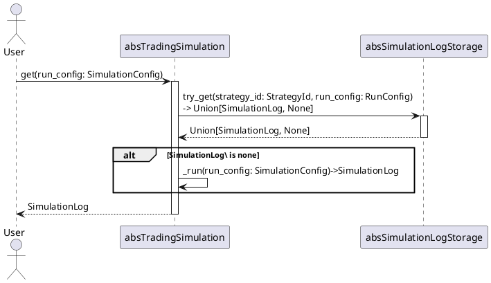

# Description
module define class for trading simulation process

# Classes
## [absTradingSimulatior](../../src/simulation/abs_trading_simulatior.py) 
define abstract base class for simulation process

### Relation

### Realization
#### pyalgotrade
- [PyalgotradeTradingSimulator](../../src/simulation/realization/pyalgotrade/pyalgotrade_trading_simulator.py) - realization of [absTradingSimulator](#abstradingsimulatior) for PyAlgoTrade
- [PyalgotradeStrategyWrapper](../../src/simulation/realization/pyalgotrade/strategy_wrapper.py) - wrapper of PyAlgoTrade Strategy for simulation process
- [DataFrameBarFeed](../../src/simulation/realization/pyalgotrade/data_frame_bar_feed.py) - realization of PyAlgoTrade BarFeed for DataFrame source

[Example of using](../../example/PyAlgoTrade_example.ipynb)

## Models
Models to store simulation result
- [Deal](../../src/simulation/models/deal.py) - model to store deal log
- [SimulationLog](../../src/simulation/models/simulation_log.py) - model to store simulation log

### Relation

## Config
[SimulationConfig](../../src/simulation/config/simulation_config.py) - config of simulation
[StrategyConfig](../../src/simulation/config/strategy_config.py) - config of strategy parameters
[StrategyId](../../src/simulation/config/strategy_id.py) - strategy ID

### Relation

## Cache
Caching simulation logs
- [absSimulationLogStorage](../../src/simulation/cache/abs_simulation_log_storage.py) - abstract class of simulation log storage

### Realization
- [InMemoryStorage](../../src/simulation/cache/in_memory_storage.py) - in memory realization of simulation log storage

# Simulation process
