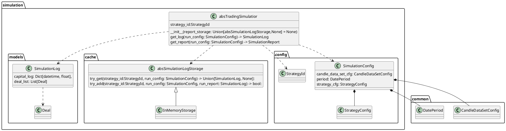
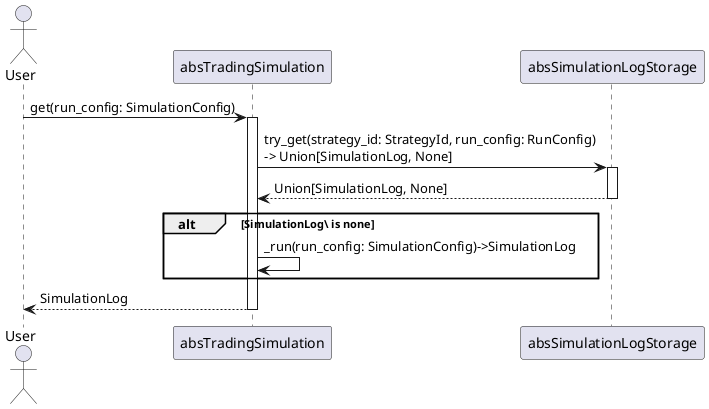

# Simulation
modul define base class for trading simulation process

## Class model

```plantuml
@startuml
namespace simulation {
  class absTradingSimulatior {
    __init__(report_storage: Union[absSimulationLogStorage,None] = None)
    get_log(run_config: SimulationConfig) -> SimulationLog
    get_report(run_config: SimulationConfig) -> SimulationReport
    strategy_id:StrategyId
  }
}

namespace simulation.models {
  class SimulationLog{
    capital_log: Dict[datetime, float],
    deal_list: List[Deal]
  }

  class Deal
}

namespace simulation.cache {
  class absSimulationLogStorage {
    try_get(strategy_id:StrategyId, run_config: SimulationConfig) -> Union[SimulationLog, None]:
    try_add(strategy_id:StrategyId, run_config: SimulationConfig, run_report: SimulationLog) -> bool:
  }

  class InMemoryStorage
}

namespace simulation.config {
  class SimulationConfig {
    candle_data_set_cfg: CandleDataSetConfig
    period: DatePeriod
    strategy_cfg: StrategyConfig
  }

  class StrategyConfig

  class StrategyId
}

namespace common {
    class CandleDataSetConfig
    class DatePeriod
}

SimulationConfig *-- StrategyConfig
SimulationConfig *-- CandleDataSetConfig
SimulationConfig *-- DatePeriod

absTradingSimulatior ..> SimulationConfig
absTradingSimulatior ..> SimulationLog
absTradingSimulatior ..> absSimulationLogStorage
absTradingSimulatior ..> StrategyId

absSimulationLogStorage <|-- InMemoryStorage 
SimulationLog ..> Deal

@enduml
```

## Simulation process

```plantuml
@startuml
actor User as u
participant absTradingSimulation as TSF
participant absSimulationLogStorage as SRS
u -> TSF: get(run_config: SimulationConfig)
activate TSF
TSF -> SRS: try_get(strategy_id: StrategyId, run_config: RunConfig)\n-> Union[SimulationLog, None]
activate SRS
SRS --> TSF: Union[SimulationLog, None]
deactivate SRS

alt SimulationLog\ is none
TSF->TSF: _run(run_config: SimulationConfig)->SimulationLog
end
TSF --> u: SimulationLog
deactivate TSF
@enduml
```