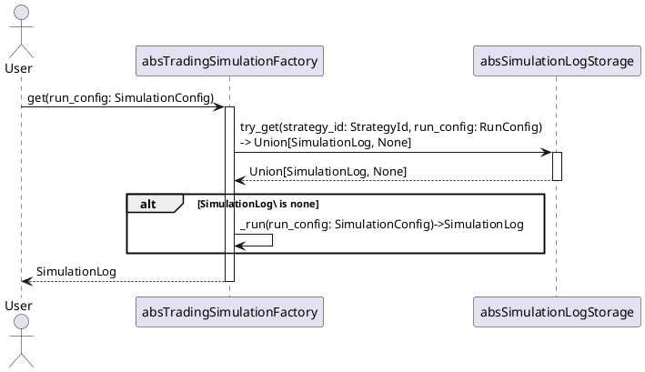

# Abstract Trading Simulation Factory
[class absTradingSimulationFactory](../../src/simulation/abs_trading_simulation_factory.py)

## Definition
Offer function to simulate trading

## Methods
### Get Simulation Log
#### Sequential
