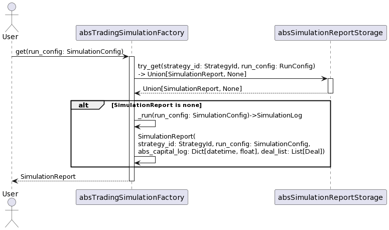

# Abstract Trading Simulation Factory
[class absTradingSimulationFactory](../../src/simulation/abs_trading_simulation_factory.py)

## Methods
### Get Simulation Report
#### Sequence


#### PlantUml
```
@startuml
actor User as u
participant absTradingSimulationFactory as TSF
participant absSimulationReportStorage as SRS
u -> TSF: get(run_config: SimulationConfig)
activate TSF
TSF -> SRS: try_get(strategy_id: StrategyId, run_config: RunConfig)\n-> Union[SimulationReport, None]
activate SRS
SRS --> TSF: Union[SimulationReport, None]
deactivate SRS

alt SimulationReport is none
TSF->TSF: _run(run_config: SimulationConfig)->SimulationLog
TSF->TSF: SimulationReport(\nstrategy_id: StrategyId, run_config: SimulationConfig,\nabs_capital_log: Dict[datetime, float], deal_list: List[Deal])
end
TSF --> u: SimulationReport
deactivate TSF
@enduml
```