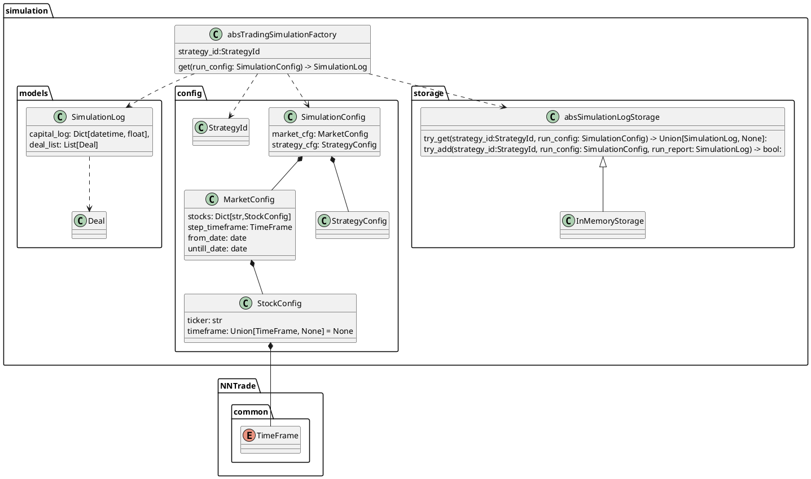

# Classes
## Link
[__init__.py](../../src/simulation/__init__.py)

## Funcitons
- Get Simulation report for config [sequence](./AbstractTradingSimulationFactory.md)

## Class model

```plantuml
@startuml
namespace simulation {
  class absTradingSimulationFactory {
    get(run_config: SimulationConfig) -> SimulationLog
    strategy_id:StrategyId
  }
}


namespace simulation.models {
  class SimulationLog{
    capital_log: Dict[datetime, float],
    deal_list: List[Deal]
  }

  class Deal
}

namespace simulation.config {
  class SimulationConfig {
    market_cfg: MarketConfig
    strategy_cfg: StrategyConfig
  }

  class MarketConfig {
    stocks: Dict[str,StockConfig]
    step_timeframe: TimeFrame
    from_date: date
    untill_date: date
  }

  class StockConfig {
    ticker: str
    timeframe: Union[TimeFrame, None] = None
  }

  class StrategyConfig

  class StrategyId
}

namespace simulation.storage {
  class absSimulationLogStorage {
    try_get(strategy_id:StrategyId, run_config: SimulationConfig) -> Union[SimulationLog, None]:
    try_add(strategy_id:StrategyId, run_config: SimulationConfig, run_report: SimulationLog) -> bool:
  }

  class InMemoryStorage
}


namespace NNTrade.common {
  enum TimeFrame
}

SimulationConfig *-- MarketConfig
MarketConfig *-- StockConfig
StockConfig *-- TimeFrame
SimulationConfig *-- StrategyConfig

absTradingSimulationFactory ..> SimulationConfig
absTradingSimulationFactory ..> SimulationLog
absTradingSimulationFactory ..> absSimulationLogStorage
absTradingSimulationFactory ..> StrategyId

absSimulationLogStorage <|-- InMemoryStorage 
SimulationLog ..> Deal
@enduml
```